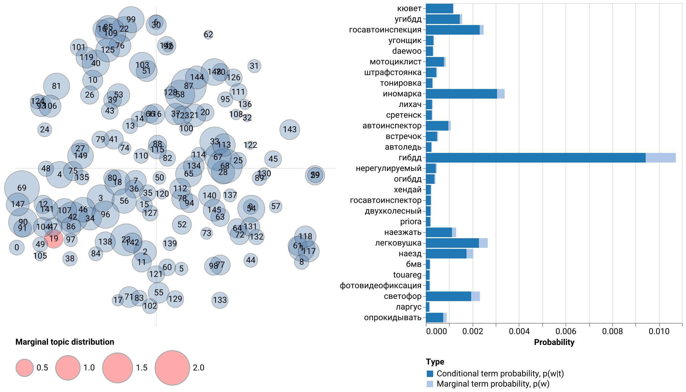

tmplot
======

**tmplot** is a Python package for visualizing topic modeling results. It
provides the interactive report interface that borrows much from
LDAvis/pyLDAvis and builds upon it offering a number of metrics for calculating
topics distances and a number of algorithms for calculating scatter coordinates
of topics.

Features
~~~~~~~~

* Supported models:

  * tomotopy: ``LDAModel``, ``LLDAModel``, ``CTModel``, ``DMRModel``, ``HDPModel``, ``PTModel``, ``SLDAModel``, ``GDMRModel``
  * gensim: ``LdaModel``, ``LdaMulticore``
  * bitermplus: ``BTM``

* Supported distance metrics:

  * Kullback-Leibler (symmetric and non-symmetric) divergence
  * Jenson-Shannon divergence
  * Jeffrey's divergence
  * Hellinger distance
  * Bhattacharyya distance
  * Total variation distance
  * Jaccard inversed index

* Supported algorithms for calculating topics scatter coordinates:

  * t-SNE
  * SpectralEmbedding
  * MDS
  * LocallyLinearEmbedding
  * Isomap

.. toctree::
   :maxdepth: 2
   :caption: Usage
   :hidden:

   Installation <installation>
   Tutorial <tutorial>

.. toctree::
   :maxdepth: 2
   :caption: API
   :hidden:

   Helper functions <tmplot_hlp>
   Distance functions <tmplot_dist>
   Report <tmplot_report>
   Stability <tmplot_stab>
   Visualization <tmplot_vis>

Indices and tables
==================

* :ref:`genindex`
* :ref:`modindex`
* :ref:`search`
